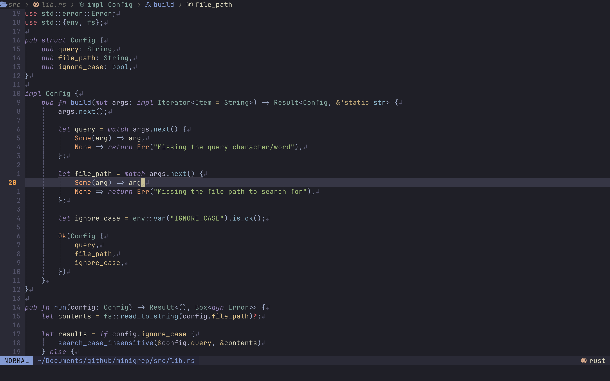

# nvim-config

- Font: [JetBrains Mono Nerd Font](https://github.com/ryanoasis/nerd-fonts/tree/master/patched-fonts/JetBrainsMono/Ligatures)
- Colorscheme: [kanagawa](https://github.com/rebelot/kanagawa.nvim)
- Terminal: [Ghostty](https://github.com/ghostty-org/ghostty)

